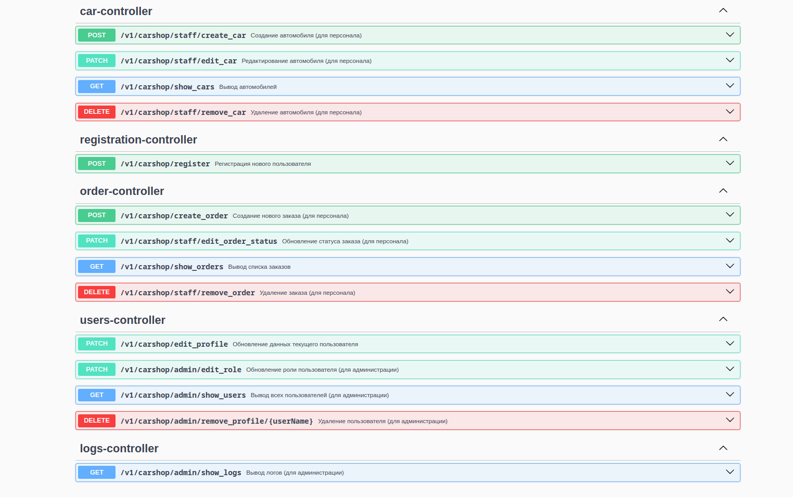

# Домашнее задание №5
# REST приложение "Автосалон" с использованием Spring Boot
# Описание
Апгрейд домашнего задания №1 с заменой репозиториев на таблицы PostgreSQL и миграцией баз данных при
помощи инструментов LiquiBase и Spring Boot

- аутентификация, авторизация и регистрация пользователей
- присвоение ролей пользователям и разделение функционала
- возможность редактирования заказов, автомобилей, информации о клиентах
- логирование и аудирование

# Стек использованных технологий:
- Java 17
- Servlet
- Maven
- Junit 5
- Mockito 
- AssertJ 
- Lombok
- AspectJ
- Jackson
- Mupstruct 1.5.5.Final
- Lombok mupstruct binding 0.2.0

# Техническое задание:
Разработайте приложение для управления автосалоном. 
Приложение должно позволять пользователям управлять базой данных автомобилей, 
обрабатывать заказы клиентов на покупку и обслуживание автомобилей, 
а также управлять учетными записями пользователей.

# Функциональные требования:
- Пользователи должны иметь возможность зарегистрироваться и войти в систему.

- Разделение ролей: администратор, менеджер, клиент.

2. Управление автомобилями

- Просмотр списка всех доступных автомобилей.

- Добавление нового автомобиля (марка, модель, год выпуска, цена, состояние и т.д.).

- Редактирование информации об автомобиле.

- Удаление автомобиля из списка.

3. Обработка заказов

- Создание заказа на покупку автомобиля.

- Просмотр и управление заказами (поиск, изменение статуса, отмена).

- Обработка заявок на обслуживание автомобиля.

4. Просмотр информации о клиентах и сотрудниках

- Просмотр списка зарегистрированных клиентов и сотрудников.

- Фильтрация и сортировка данных по различным критериям (имя, контактная информация, количество покупок и т.д.).

- Добавление и редактирование информации о сотрудниках.

5. Фильтрация и поиск

- Поиск автомобилей по марке, модели, году выпуска, цене и другим характеристикам.

- Поиск заказов по дате, клиенту, статусу и автомобилю.

6. Аудит действий пользователя

- Логирование всех значимых действий пользователей (например, добавление/удаление автомобилей, создание/удаление заказов, авторизация и тд).

- Просмотр и фильтрация журнала действий по дате, пользователю и типу действия.

# Запуск
Создание подключения к БД через docker compose, 
запуск приложения по адресу http://localhost:8080
```sh
make run
```

# Основные запросы:
